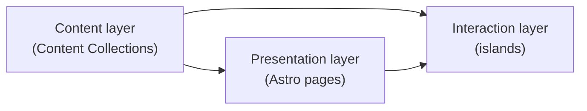
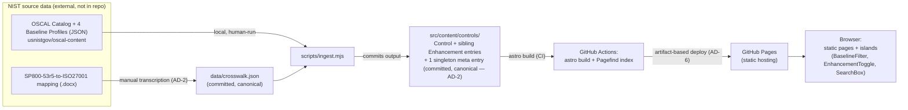
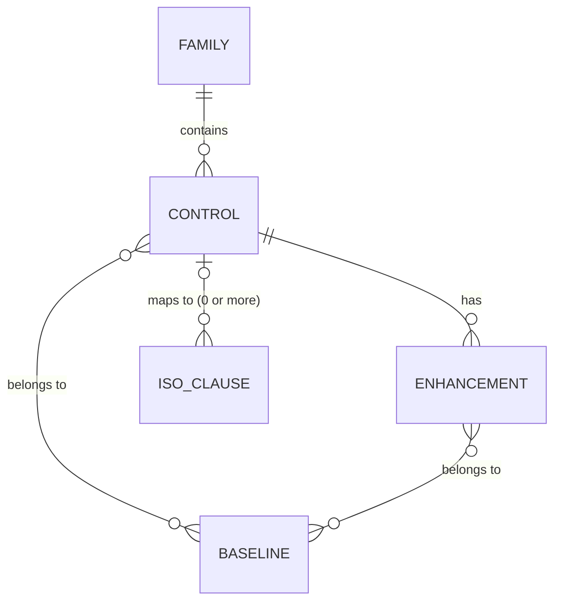

# Architecture Spine — NIST 800-53 Browser

## Design Paradigm

**Static-first Islands Architecture**, three layers:

- **Content layer** — Astro Content Collections, populated only at build time by a single ingestion script. Never touched at runtime.
- **Presentation layer** — Astro pages/components, rendered to static HTML per route (`src/pages/`). Owns layout, typography, and the family/control/enhancement page shapes.
- **Interaction layer** — client-side "islands" (`src/components/`): `BaselineFilter`, `EnhancementToggle`, `SearchBox`. The only code that runs in the browser; everything else ships as static HTML.

Dependency direction — presentation and interaction may depend on the content layer; the content layer depends on nothing downstream:



## Invariants & Rules

### AD-1 — Static-first, no backend `[ADOPTED — from PRD]`

- **Binds:** all
- **Prevents:** any component depending on a server, database, or runtime API call
- **Rule:** All control/baseline/crosswalk data is resolved at build time into static output. Code that runs after deploy may only execute client-side, in the browser, against already-built static assets.

### AD-2 — Single canonical ingestion pipeline, run locally, with a pinned output shape

- **Binds:** content layer, all of FR-1 through FR-5
- **Prevents:** pages or islands independently parsing raw OSCAL/crosswalk source, computing baseline membership differently, or disagreeing on what the Content Collection actually contains
- **Rule:** One script (`scripts/ingest.mjs`) is the only code path allowed to read raw OSCAL JSON and the crosswalk source — it imports `src/utils/slugify.ts` rather than reimplementing it (closes the "local tool, not bound by AD-4" loophole). It is run locally and by hand, never by CI. Its output is committed to the repo as the source of truth and has this exact shape:
  - **One Content Collection entry per Control** *and* **one sibling entry per Enhancement** (`ac-2.json`, `ac-2-1.json`, …) — not an embedded array. Each Enhancement entry carries `parentId` pointing to its Control's slug. This matches the erDiagram's `CONTROL ||--o{ ENHANCEMENT` modeling it as a distinct entity.
  - **Baseline membership is computed and attached at both Control and Enhancement granularity** — an Enhancement does not inherit its parent's baselines implicitly; NIST baselines routinely include a control without pulling in all of its enhancements. Matches the erDiagram's separate `ENHANCEMENT }o--o{ BASELINE` relation.
  - **Provenance metadata (OSCAL Catalog version, crosswalk transcription date) is a single singleton entry**, not duplicated onto every Control/Enhancement — see AD-5 for who reads it.

  Every page, island, and the CI build read only this committed collection — never raw OSCAL.

### AD-3 — URL is the source of truth for shareable state, merged non-destructively

- **Binds:** FR-2 (baseline filter), FR-3 (enhancement expand), FR-5 (search)
- **Prevents:** an island holding filter/expand/search state only in local component state; two islands on the same page clobbering the piece of the URL they don't own; ambiguity about what "no reload" means across a route boundary
- **Rule:** Baseline filter state lives in `?baseline=`; expanded-enhancement state lives in the URL fragment (`#{control-slug}-{n}`); search query lives in `?q=` on `/search`. All URL writes — from any island — go through one shared `setUrlState()` helper that merges into `location.search` / `location.hash` without clobbering the piece it doesn't own (e.g. setting `?baseline=` must preserve an existing `#ac-2-1` fragment, and vice versa). Every state category uses `replaceState`, not `pushState` — filter, search, and expand/collapse changes do not spam browser history. "Without a full page reload" applies only *within* a route: `BaselineFilter` and `EnhancementToggle` never cross a route boundary. `SearchBox`'s global instance (AD-7) is the one exception — entering a query from any route other than `/search` is a normal full-page navigation to `/search?q=…`, consistent with AD-1's no-client-router MPA model; only once already on `/search` does typing update `?q=` in place via the shared helper.

### AD-4 — Routing and slug scheme, with a pinned input contract

- **Binds:** all pages, FR-1 through FR-5
- **Rule:** `/families/{slug}`, `/controls/{slug}`, enhancement anchors `#{parent-slug}-{n}`. Slugs are lowercase-hyphenated (`ac-2`, `ac-2-1`), produced by one shared `src/utils/slugify.ts`, always called on the **OSCAL-native id** (`ac-2.1`) — never on the canonical display string (`AC-2(1)`), since the two are not guaranteed to normalize identically (parens vs. dots). Every caller, including `scripts/ingest.mjs` (AD-2), imports this one module. Canonical uppercase form (`AC-2`, `AC-2(1)`) is used for all display text, never the slug.
- **Base-path rule:** the site deploys to a GitHub Pages *project* path (`/NIST-800-53-browser`), so the routes above are site-relative, not absolute. Every internal link and asset reference resolves through Astro's `base` (`import.meta.env.BASE_URL`, or a `<a href={...}>` built from it) — never a hardcoded leading-slash path like `/controls/ac-2`, which resolves to the domain root and 404s in production while working fine in `astro dev`.
- **Prevents:** two routes/components generating different casings, separators, or normalization for the same control id — or one building base-aware links while another hardcodes absolute paths, producing a site where half the deep links work.

### AD-5 — Content fidelity and provenance, rendered once

- **Binds:** ingestion script (AD-2), `layouts/BaseLayout.astro`
- **Prevents:** rendered control text silently drifting from the OSCAL source; a stale build reading as current; two components disagreeing on where the provenance stamp lives
- **Rule:** Control statements and titles render verbatim from the ingested OSCAL data — no paraphrasing at the ingestion, content, or presentation layer. The ingestion script writes the source OSCAL Catalog version/date and the crosswalk transcription date into the one singleton metadata entry (AD-2). `BaseLayout.astro` is the only place that renders it — once, in the global footer, alongside the disclaimer (AD-7) — not the Control Detail Page individually.

### AD-6 — Deployment is CI-only, ingestion is not

- **Binds:** all (build/deploy path)
- **Prevents:** local and CI builds drifting from each other, or a manual publish bypassing the committed content
- **Rule:** GitHub Actions, triggered on push to `main`, is the only path that publishes the site — via GitHub's artifact-based Pages deploy (`actions/deploy-pages`), not a `gh-pages` branch push. It runs `astro build` against the already-committed Content Collection, then Pagefind indexing, then deploy. CI never runs the ingestion script (AD-2) — ingestion is a local, human-reviewed step whose output is checked in before push.

### AD-7 — Global chrome: Search and Baseline filter live in the shared layout, and own DOM-level filtering

- **Binds:** FR-2 (baseline filter), FR-5 (search)
- **Prevents:** Search or the Baseline filter being built as page-local widgets that vanish on other routes; nobody being responsible for actually hiding non-matching rows when `?baseline=` changes
- **Rule:** `SearchBox` and `BaselineFilter` mount inside `layouts/BaseLayout.astro`, which every route (`index`, `families/[slug]`, `controls/[slug]`, `search`) renders through — not inside any individual page. This is what makes both available "from any screen" per the PRD IA note, not just a routing coincidence. Family/control list pages render each row with a `data-baselines` attribute (from AD-2's per-entry baseline flags) at build time; `BaselineFilter` is the *only* code that shows/hides rows based on it. The pre-hydration paint is always the unfiltered list — filtering is a client-side effect of `BaselineFilter` reading `?baseline=`, not a build-time branch.

## Consistency Conventions

| Concern | Convention |
| --- | --- |
| Naming (entities, files, interfaces) | Canonical uppercase display (`AC-2`, `AC-2(1)`) from OSCAL; lowercase-hyphenated slugs (`ac-2`, `ac-2-1`) for URLs and Content Collection filenames, via one shared `slugify()`. |
| Data & formats (ids, dates, provenance) | Control/Enhancement ids stored as OSCAL-native strings. Dates as ISO 8601. OSCAL Catalog version and crosswalk transcription date stored as one singleton metadata entry, rendered only by `BaseLayout.astro` (AD-2, AD-5). |
| State & cross-cutting (mutation, auth, missing data) | No auth — public site, nothing to authenticate. Shareable UI state lives in the URL, merged non-destructively through one shared writer, never local-only (AD-3). A Control with no published ISO mapping renders "No ISO 27001 mapping published" — never a blank section. |
| Layout & responsiveness | Mobile-first CSS: base styles target phone width, wider layouts are additive via breakpoints — never the reverse. Astro's scoped per-component `<style>` plus one shared base stylesheet (typography, spacing scale) in `BaseLayout.astro`; no separate CSS framework pinned for v1. |
| Provenance disclaimer | `BaseLayout.astro` always renders an "unofficial reading tool — not for audit or compliance use" statement (PRD §11). Exact placement (every page vs. footer-only) is still open — see Deferred — but *that it exists on every page* is not. |
| Performance budget | Traces to AD-1: static output + Pagefind's build-time index are what make the PRD's ~2s initial-load / ~200ms navigation targets (PRD §10) achievable without a server round trip. No separate performance-monitoring tooling is in scope for v1. |

## Stack

| Name | Version |
| --- | --- |
| Astro | 7.3.2 (installed 2026-09-15; supersedes the 7.2.4 recorded at authoring) |
| Node.js | ≥22.12.0 (Astro 7's `engines` floor). Dev machine runs 24.14.1 (Active LTS) |
| Pagefind | 1.5.2 (installed as a devDependency; invoked as a CLI from the `build` script) |
| ~~astro-pagefind (integration)~~ | **Not used.** It went 1.8.5 → 2.0.1 (major) between authoring and scaffolding, and the spine had already committed `components/SearchBox` to Pagefind's own JS API rather than the wrapper's prebuilt UI — leaving the wrapper doing build wiring only, which `pagefind --site dist` does directly with no integration API to track across majors. |
| Ingestion script runtime | Node.js (matches the rest of the toolchain; not architecturally binding — local, one-off tool) |
| Hosting | GitHub Pages, deployed via GitHub Actions |

## Structural Seed





```text
{root}/
  src/
    content/
      controls/         # canonical Content Collection: one entry per Control, sibling entries per Enhancement (parentId), 1 singleton meta entry (AD-2)
      config.ts          # Zod schema: Control, Enhancement, Baseline, ISOClause, Meta
    utils/
      slugify.ts          # the one shared slug function — OSCAL-native id in, slug out (AD-4). Imported by ingest.mjs too.
    layouts/
      BaseLayout.astro    # shared chrome every route renders through — hosts SearchBox, BaselineFilter, provenance stamp + disclaimer (AD-5, AD-7)
    pages/
      index.astro
      families/[slug].astro
      controls/[slug].astro
      search.astro
    components/          # islands: BaselineFilter, EnhancementToggle, SearchBox (AD-3, AD-7) — share one setUrlState() helper (AD-3)
  scripts/
    ingest.mjs            # local, human-run ingestion script (AD-2) — reads raw OSCAL + crosswalk.json, imports src/utils/slugify.ts
  data/
    raw/                  # raw OSCAL catalog/baseline JSON, downloaded from usnistgov/oscal-content
    crosswalk.json         # hand-transcribed ISO 27001 crosswalk — source of truth, checked in
  .github/workflows/
    deploy.yml             # CI: astro build + Pagefind index + artifact-based Pages deploy (AD-6)
```

## Capability → Architecture Map

| Capability / Area | Lives in | Governed by |
| --- | --- | --- |
| FR-1 Browse by family | `pages/families/[slug].astro`, `pages/index.astro` | AD-2, AD-4 |
| FR-2 Baseline filter | `layouts/BaseLayout.astro` + `components/BaselineFilter` (island) | AD-2, AD-3, AD-4, AD-7 |
| FR-3 Control detail + inline enhancements | `pages/controls/[slug].astro`, `components/EnhancementToggle` (island) | AD-2, AD-3, AD-4, AD-5 |
| FR-4 ISO 27001 crosswalk | `pages/controls/[slug].astro` (crosswalk section), `scripts/ingest.mjs` + `data/crosswalk.json` | AD-2, AD-4, AD-5 |
| FR-5 Search | `layouts/BaseLayout.astro` + `components/SearchBox` (island), `pages/search.astro`, Pagefind index | AD-2, AD-3, AD-7 |

## Deferred

- **Automated/scheduled re-ingestion** when NIST publishes catalog/crosswalk updates — v1 ingestion is manually triggered locally (ties to PRD Open Question 1).
- **Scripted docx-parsing or OSCAL-native Mapping-model authoring** for the ISO crosswalk — v1 is hand-transcription (AD-2); noted as a revisit the user is interested in for the learning experience, not a v1 gap.
- **Formal accessibility compliance** (e.g. WCAG 2.1 AA) — PRD explicitly defers this; phone-readability itself remains required (see Consistency Conventions / PRD Cross-Cutting NFRs).
- **Multi-environment setup** (staging, preview deploys) — not needed at hobby scope; GitHub Pages serves a single production environment.
- **Disclaimer's exact wording** — PRD Open Question 2. Note *that* it renders on every page, and *where* (global footer, alongside provenance) is fixed by AD-5/AD-7 and not deferred; only the copy itself is open.
- **Ingestion script's implementation language** beyond "Node.js by convention" — it's a local, one-off tool outside the deployed system; not worth binding further.
- **Other frameworks** (CMMC, PCI-DSS) or a Rev 4 comparison view — explicitly out of scope per PRD §5/§6.2/Open Question 4; no architectural provision made for them in v1.
- **Pagefind's default matching behavior vs. PRD's "plain substring is sufficient for v1" scope boundary** (PRD Open Question 3) — not reconciled; Pagefind ships some fuzzy/typo tolerance by default. Verify it tokenizes hyphenated control IDs (`AC-2`) sensibly before treating FR-5 as done; tighten its config if results are noisier than the PRD's plain-match intent.
- **Rollback on a failed deploy, custom domain, and uptime/monitoring** — not decided; GitHub Pages' defaults apply for v1, revisit only if a real incident makes it worth the setup.
