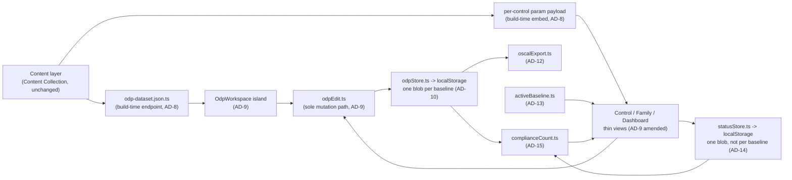
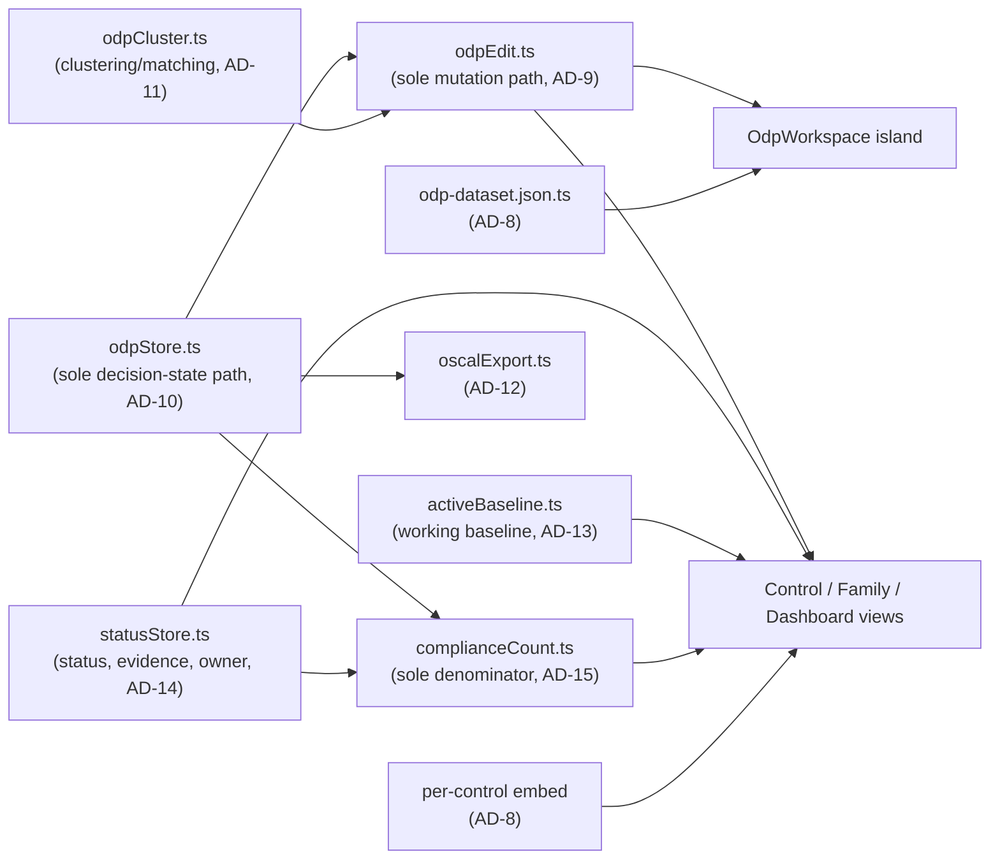

# Architecture Spine — Compliance Workbench (ODP Tailoring Workspace)

## Design Paradigm

The existing Browser's **Static-first Islands Architecture** (content / presentation / interaction layers, AD-1–AD-7 below) is inherited unchanged.

**As originally written (2026-09-21)**, this feature added exactly one new interaction-layer unit: a dedicated stateful workspace island (`OdpWorkspace`) owning the entire ODP-tailoring flow, with every other page staying exactly as static as it was.

**As amended (2026-09-29)**, the paradigm shifts from *one stateful island* to *one stateful core with several thin views*. Decision state still has exactly one owner (`odpStore.ts`) and decision *mutation* now has exactly one owner (`odpEdit.ts`, AD-9 amended) — but Control pages, Family pages and the home Dashboard may mount those modules rather than only linking into the workspace. The static-first commitment is unchanged: every page is still prerendered, every island still hydrates over static HTML, and every page remains fully readable with JavaScript disabled.



## Inherited Invariants

Read-only, binding, not re-derived — from `architecture-BMad-2026-08-20/ARCHITECTURE-SPINE.md`. A new AD below that would contradict one of these is a conflict, not an override.

| Inherited | From parent | Binds here |
| --- | --- | --- |
| AD-1 — Static-first, no backend | Browser spine | The workspace island runs entirely client-side against build-time static assets (incl. AD-8's dataset); no server/API is introduced. |
| AD-2 — Single canonical ingestion pipeline | Browser spine | `scripts/ingest.mjs` is untouched by this feature — AD-8 derives from its committed output, never from raw OSCAL. |
| AD-3 — URL is the source of truth for shareable state | Browser spine | The workspace's baseline selection lives in the route (`/workspace/{baseline}`); it does not introduce a second shareable-state mechanism. Decision data itself is local-device state (AD-10), not shareable — deliberately not put in the URL. |
| AD-4 — Routing/slug scheme, base-path rule | Browser spine | `/workspace/{baseline}` follows the same slug and `BASE_URL` rules as every other route. |
| AD-5 — Content fidelity and provenance | Browser spine | AD-8's dataset carries `guidelines`/`label` verbatim from the same Content Collection; no paraphrasing introduced. |
| AD-6 — Deployment is CI-only | Browser spine | No new deploy path. `odp-dataset.json.ts` builds inside the existing `astro build` CI step; no local generation step is added. |
| AD-7 — Global chrome hosts the islands | Browser spine | `OdpWorkspace` is a page-scoped island (like `EnhancementItem`), not global chrome — it does not mount in `BaseLayout.astro`. |

## Invariants & Rules



### AD-8 — ODP dataset is a build-time static endpoint derived from the committed Content Collection, never from raw OSCAL

- **Binds:** FR-1 through FR-6, FR-13
- **Prevents:** a second code path independently parsing raw OSCAL or recomputing baseline membership, disagreeing with `scripts/ingest.mjs` (AD-2) about what a Control's params actually are
- **Rule:** `src/pages/odp-dataset.json.ts` is an Astro build-time endpoint that reads `getCollection('controls')` — the same committed collection every page reads — and emits a flat array of `{ controlSlug, controlId, familyCode, paramId, label, guidelines, select, baselines }`, one entry per parameter instance in the corpus. It never reads `data/raw/` or invokes `scripts/ingest.mjs`; it runs inside the same `astro build` CI step as every other route (AD-6).

### AD-9 — One owner of decision mutation semantics; any surface may host it *(amended 2026-09-29)*

- **Binds:** FR-4 through FR-15
- **Prevents:** a per-control param editor and a separate dashboard independently reading/writing the same localStorage blob and disagreeing on shape, fan-out timing, or validation
- **Rule (amended):** `utils/odpEdit.ts` is the sole owner of decision *mutation semantics* — value-field construction, value read/write, override-rationale validation, and dash-one fan-out. `odpStore.ts` remains the sole owner of decision *state* (AD-10, unchanged). Any surface may read decisions and may offer editing, but **only by mounting `odpEdit.ts`** — never by calling `setDecision` directly, and never by reimplementing validation or fan-out. `components/workspace/OdpWorkspace` is the first consumer of that module rather than the owner of the flow.

**Original rule (2026-09-21), superseded:**

> `src/pages/workspace/[baseline].astro` renders exactly one client island, `components/workspace/OdpWorkspace`, that owns the entire flow: dash-one batch entry, individual param entry, the readiness dashboard, and OSCAL export. `controls/[slug].astro` and every other existing page may **link into** the workspace (e.g. a deep link scoped to one control) but never read or write decision data themselves.

**Why it changed.** The original rule located the invariant in a *place* (one island) when the thing actually worth protecting was a *contract* (one validation and fan-out path). Connecting the Browser to the Workspace — so a reader of AC-2 sees the values their organization chose, and can revise one without losing the statement context that made it answerable — requires a second editing surface. The amended rule delivers that while strengthening what the original was defending: mutation logic now lives in a module that cannot be duplicated by accident, rather than in a 1,475-line island that any new surface would have been tempted to copy from.

**What is still forbidden:** a second `localStorage` path (AD-10), a second validation implementation, a second fan-out loop, and any surface writing a decision without going through `odpEdit.ts`. Verify with a grep: `setDecision` is called from `odpEdit.ts` and nowhere else.

### AD-10 — One JSON blob per baseline in localStorage, one schema version, one read/write module

- **Binds:** FR-7 through FR-17
- **Prevents:** the dashboard, batch-entry UI, and export each reading a partially-consistent view of decisions; ad hoc per-entry migration when the shape changes
- **Rule:** `localStorage['odp-decisions:<baseline>']` holds one JSON object: `{ schemaVersion: number, decisions: { [key: string]: { value, status, rationale } } }`, where `key = "${controlSlug}:${paramId}"` — globally unambiguous, so export needs no reverse lookup. `value` is `string | string[]` — an array when the dataset's `select.howMany` for that param is `'one-or-more'` (97 real parameters, including `odp.03` present in every one of the 18 dash-one controls — verified against real data, not assumed single-select), a plain string otherwise. All reads/writes go through one shared module, `utils/odpStore.ts`; no other file calls `localStorage` directly for this feature. A missing key defaults to `status: 'unreviewed-default'` (FR-8, no value). A corrupt/unparseable blob is treated as empty state and logged to console — never an uncaught exception, never silently fabricated data.

### AD-11 — Dash-one batching is a write-time fan-out and a read-time display grouping; never a stored cluster reference

- **Binds:** FR-4, FR-5, FR-6
- **Prevents:** export or dashboard logic assuming a "cluster" record exists in storage; the batch-entry UI and the dashboard grouping dash-one rows by two different rules
- **Rule:** Setting a batched value writes N fully independent entries into the AD-10 blob in one pass (one per dash-one control's matching param) — nothing marks them as batch-derived. Cluster membership for display (grouping rows, flagging a partial override like Dana's PE-1 in UJ-1) is recomputed at render time by matching `paramId` after stripping the `^<familyCode>-1_` / `^<familyCode>-01_` prefix — the pattern verified against real data (18 of the 20 dash-one controls share an identical 9-suffix shape; `pm-1` is the sole structural outlier and is excluded anyway by baseline scoping). Implemented once in `utils/odpCluster.ts`, imported by both the batch-entry UI and the dashboard — never reimplemented. Equality for "still matches the batch value" is order-independent set equality when `value` is an array (AD-10's `one-or-more` case), plain string equality otherwise — a naive string/array comparison would falsely flag every `odp.03` decision (present in all 18 dash-one controls) as diverged even when untouched.

  **Build-time membership index (story 11).** Control pages embed a per-baseline member list (`utils/odpClusterIndex.ts`, produced by `groupDashOneClusters` over the same Content Collection) so the popover can offer a batch scope without shipping the dataset. This is a display index, **not** a stored cluster reference: no decision record refers to it, fan-out still writes N independent decisions, and the match count is recomputed from `odpStore` on every change. Membership is per baseline (18 controls in Low/Moderate/High, 12 in Privacy), so the popover never assumes a fixed count.

### AD-12 — OSCAL export target and shape

- **Binds:** FR-13, FR-14, FR-15
- **Prevents:** export code guessing at a schema version or where rationale belongs
- **Rule:** `utils/oscalExport.ts` serializes the AD-10 blob into an OSCAL Profile document at `oscal-version: "1.2.2"` — the same version already present in the ingested corpus (`data/raw/*.json`'s `metadata.oscal-version`), so no version negotiation is needed. One `set-parameter` per decision: `param-id` (from the AD-10 key's `paramId`), `values: Array.isArray(value) ? value : [value]` (OSCAL's `values` is always an array, regardless of the source param's `howMany` — AD-10's `value` is only sometimes an array, this is where that's reconciled, in exactly one place), and `remarks: rationale` when present. Validity is checked manually via `oscal-cli validate` during development (FR-15) — no schema validator ships in the client bundle.

### AD-13 — One app-global working baseline, one module *(added 2026-09-29)*

- **Binds:** the Browser↔Workspace integration (stories 8–11, 20) and the compliance dashboard (stories 15–16)
- **Prevents:** each page inferring a baseline from its own URL, content or a hardcoded default, so the same parameter shows a Moderate value on one page and a High value on the next — and, worse, an edit landing in a blob the user did not think they were working in
- **Rule:** `utils/activeBaseline.ts` owns one persisted, app-global **working baseline**, surfaced in global chrome. Every decision read or write outside `/workspace/{baseline}` resolves its baseline through that module exclusively. The workspace route's path baseline stays authoritative for its own page and writes back to the working baseline on mount, so the two never silently disagree. The module owns the fallback too: a missing or invalid stored value resolves to `moderate` inside `activeBaseline.ts`, never in a page. Changes are announced with an `activebaselinechange` window event.

  The **working baseline is not the display filter.** They answer different questions and are separate controls: `BaselineFilter` answers *what do I want to see on this page* and keeps its `All` option; the working baseline answers *whose decisions am I making* and has **no `All`**. Selecting a filter value may offer to switch the working baseline; it never does so silently.

  A decision is only meaningful for an item within the working baseline. **591 of 1,014 non-withdrawn items belong to no baseline at all** (395 of them carrying 754 params, 47% of the corpus), and the workspace filters them out — so a parameter slot on such an item renders non-interactive, and recording a decision there is out of scope: it would be invisible to the workspace and absent from the OSCAL export.

### AD-14 — Control status is per-system, in one blob; baseline is a view filter *(added 2026-09-29)*

- **Binds:** the compliance dashboard (stories 13–19)
- **Prevents:** two divergent statuses for the same control under two baselines, and the ambiguity of whether "filter by baseline" filters a view or switches a dataset
- **Rule:** Control implementation status, evidence and owner live in **one** `localStorage` blob keyed `control-status` — not one per baseline. `utils/statusStore.ts` owns all reads and writes, mirroring `odpStore.ts`'s corrupt-safe contract: a missing or unparseable blob is empty state, never a crash, never a fabricated status. Baseline is a **view filter over that single dataset**. Records are keyed by item slug and cover **Enhancements as well as Controls** — statusing base Controls only would cover 177 of 287 Moderate items, 62% of the obligation displayed as 100%. `not-applicable` requires a non-empty justification, refused at the store boundary exactly as `overridden` requires a rationale in `odpStore`.

  **The asymmetry with AD-10 is deliberate and load-bearing.** ODP values are per-baseline because they genuinely differ — High may demand a scan frequency Moderate does not. Implementation status does not work that way: you pursue one authorization, and AC-2 is either implemented in your system or it is not. Anyone reading the two modules side by side will read this as an inconsistency to clean up. It is not.

  **ODP interlock (story 15).** `compliant` cannot be saved while any of the item's own parameters is unreviewed in the *working* baseline (`utils/odpInterlock.ts`, reading the per-control page payload and `odpStore`, counting through `odpCounts`). The verdict can differ between baselines for the same item, so the message always names one. Items with no parameters, or not in the working baseline, are never gated; only a move into `compliant` is blocked, so an already-compliant item is noted rather than trapped.

### AD-15 — One completion-count rule set, in one module *(added 2026-09-29)*

- **Binds:** the compliance dashboard (stories 16–17, 19)
- **Prevents:** each surface deriving its own denominator, every variation of which inflates the completion figure
- **Rule:** `utils/complianceCount.ts` is the only place completion is counted, under one rule set: **withdrawn items never counted** (182 of them); **Enhancements counted as first-class items**; **`not-applicable` excluded from the denominator entirely**, never counted as complete; **baseline-less PM controls always included** regardless of the active filter and reported as their own line, rather than silently dropped the way `entries.filter(e => e.baselines.includes(...))` drops them today. Every surface displaying a percentage displays its raw fraction beside it — `64% (176/275)` — because a percentage over an invisible denominator is unauditable, and auditability is the product's purpose.

## Consistency Conventions

| Concern | Convention |
| --- | --- |
| Naming | Decision key = `"${controlSlug}:${paramId}"` (AD-10). Status key = item slug (AD-14). Route: `/workspace/{baseline}`. Modules: `odpStore.ts` (decision storage), `odpEdit.ts` (decision mutation), `odpCluster.ts` (clustering), `oscalExport.ts` (serialization), `activeBaseline.ts` (working baseline), `statusStore.ts` (status/evidence/owner storage), `complianceCount.ts` (completion counting) — one responsibility each, no overlap. |
| Data & formats | Decision `status`: `'unreviewed-default' \| 'confirmed' \| 'overridden'`; `rationale` required iff `overridden` (FR-9). Control `status`: `'incomplete' \| 'in-progress' \| 'compliant' \| 'not-applicable'`; `justification` required iff `not-applicable` (AD-14) — same idiom, same enforcement point. Evidence is a structured `{ note, url, collectedAt }` reference, never an uploaded file. `schemaVersion`: integer per blob, bumped whenever that blob's shape changes. |
| State & cross-cutting | All localStorage access goes through `odpStore.ts` (decisions) or `statusStore.ts` (status) — no direct calls elsewhere. **One read-only exception (story 18):** `utils/originStorage.ts` totals the whole origin's localStorage for the storage budget, because the quota is shared with other projects on the same `github.io` origin; it reads no meaning and writes nothing. Backup and restore use the stores' raw read/write functions, never localStorage directly. A corrupt or missing blob is treated as empty state, never thrown as an uncaught error and never used to fabricate default values (FR-8's ceiling-effect protection depends on this). Both stores read through a cache invalidated on write: `getDecision` otherwise re-parses the entire blob per call, which at 643 entries means 643 full parses per dashboard refresh. Multi-tab writes remain last-write-wins, **refined 2026-09-29** to add passive cross-tab refresh via `storage` events — no locking, no `BroadcastChannel`, no conflict resolution; a narrowing of the original convention, not a contradiction of it. |
| Reading a decision across baselines | Decisions are per-baseline (AD-10) and Low ⊂ Moderate ⊂ High strictly, so all 643 Moderate parameters recur in High. A decision from another baseline may be **proposed** with its provenance and must be explicitly confirmed; it is **never auto-copied**. An auto-copy would fabricate review status — the exact unexamined-ceiling failure this feature exists to prevent — and is substantively wrong, since High legitimately demands stricter values than Moderate for parameters such as scan frequency and log retention. |

## Stack

| Name | Version |
| --- | --- |
| Astro | 7.3.2 (inherited, unchanged) |
| Node.js | ≥22.12.0 (inherited, unchanged) |
| `oscal-cli` | Dev-time verification only (FR-15) — not a project dependency, not installed; run manually against export output during development. |

No new runtime dependency is introduced — batching, clustering, storage, and OSCAL serialization are all hand-rolled against the existing toolchain, per AD-8 through AD-12.

## Structural Seed

```text
{root}/
  src/
    pages/
      odp-dataset.json.ts        # build-time static JSON endpoint (AD-8), derived from getCollection('controls')
      workspace/
        [baseline].astro         # the one workspace route (AD-9)
    components/
      workspace/
        OdpWorkspace.astro       # the single stateful island — batch entry, individual entry, dashboard, export (AD-9)
    utils/
      odpStore.ts                # sole decision-state read/write path (AD-10)
      odpEdit.ts                 # sole decision-mutation path: fields, validation, fan-out (AD-9, amended)
      odpCluster.ts               # dash-one id-suffix matching, shared by batch UI + dashboard (AD-11)
      odpCounts.ts                # the one ODP status tally, shared by dashboard, control summary, family column
      odpReadiness.ts             # in-baseline readiness roll-up over a control and its enhancements
      oscalExport.ts              # serializes the decision blob to an OSCAL Profile document (AD-12)
      activeBaseline.ts           # the one app-global working baseline (AD-13)
      statusStore.ts              # control status, evidence, owner — one blob, not per baseline (AD-14)
      complianceCount.ts          # the one completion-denominator rule set (AD-15)
```

Added by the 2026-09-29 amendments, alongside the above: a client overlay
that resolves addressable ODP slots on Control and Family pages, an editing
popover mounting `odpEdit.ts`, a per-item status control shared by
`controls/[slug].astro` and `EnhancementItem.astro`, and the home dashboard.
None of them is a new owner of state — each is a thin view over the modules
listed here.

## Capability → Architecture Map

| Capability / Area | Lives in | Governed by |
| --- | --- | --- |
| FR-1, FR-2 Baseline scoping | `odp-dataset.json.ts` | AD-8 |
| FR-3–FR-6 Dash-one clustering, batched entry | `components/workspace/OdpWorkspace`, `utils/odpCluster.ts` | AD-9, AD-11 |
| FR-7–FR-9 Decision state, rationale | `utils/odpStore.ts`, `OdpWorkspace` | AD-10 |
| FR-10–FR-12 Readiness gate, dashboard | `OdpWorkspace` (dashboard view), `odpStore.ts` | AD-9, AD-10 |
| FR-13–FR-15 OSCAL export | `utils/oscalExport.ts` | AD-12 |
| FR-16, FR-17 Persistence | `utils/odpStore.ts` | AD-10 |

Added by the 2026-09-29 amendments:

| Capability / Area | Lives in | Governed by |
| --- | --- | --- |
| CAP-6 Decided values in Control prose; edit in place | ODP slot overlay + popover, `utils/odpEdit.ts` | AD-9 (amended), AD-13 |
| CAP-6 Working baseline, readiness chip | `utils/activeBaseline.ts`, `BaseLayout.astro` | AD-13 |
| CAP-7 Control status and owner | `utils/statusStore.ts`, per-item status control | AD-14 |
| CAP-7 Evidence references | `utils/statusStore.ts` | AD-14 |
| CAP-8 Compliance dashboard | `utils/complianceCount.ts`, home dashboard | AD-14, AD-15 |
| CAP-9 Cross-baseline decision proposals | `utils/odpStore.ts` (read across blobs), popover + workspace | AD-10, AD-13 |
| CAP-10 Backup / restore of all local state | one versioned envelope over both blobs | AD-10, AD-14 |
| Compliant-requires-reviewed-ODPs interlock | per-item status control, reading `odpStore.ts` | AD-13, AD-14 (gates CAP-7 on CAP-3) |

## Deferred

- **Multi-tab conflict resolution** — last-write-wins is accepted (Consistency Conventions); no locking, no `BroadcastChannel`, consistent with the PRD's no-multi-user Non-Goal. *(Refined 2026-09-29: passive cross-tab refresh via `storage` events is now committed. Conflict* resolution *remains deferred — a second tab's write still silently wins.)*
- **Corruption-recovery UX** — AD-10 fixes that a corrupt blob is treated as empty state and never crashes, but no user-facing "we reset your data" notice is designed yet.
- **Additional ODP clusters beyond dash-one** (PRD Open Question) — `odpCluster.ts` is the one place a second matching rule would be added; no architectural provision beyond that single module exists yet.
- **Baselines beyond Moderate** — the route and dataset are already parameterized by `{baseline}`, but Low/High/Privacy are untested; PRD scopes v1 to Moderate only. *(Note 2026-09-29: AD-13 and the cross-baseline proposal rule assume Moderate→High is a real user path, since Low ⊂ Moderate ⊂ High strictly. Testing High is now a prerequisite for that work, not an optional extension.)*
- ~~**Per-control "N params need review" deep-link badge**~~ — **committed 2026-09-29** as part of the Browser↔Workspace integration, and expanded well past a badge: decided values render inline in Control prose and are editable in place (AD-9 amended).
- **File-attachment evidence** — evidence is a structured `{ note, url, collectedAt }` reference (AD-14); storing files would need IndexedDB, since base64 in `localStorage` shares a ~5MB origin quota with the decision blobs and would make `setDecision` fail from an unrelated page. Deliberately out of scope, not merely unbuilt.
- **OSCAL export of status and evidence** — `oscalExport.ts` emits a Profile (AD-12). Status and evidence belong to a different OSCAL model (an SSP's `implemented-requirements`, or Assessment Results). That is a sibling module, never an extension of AD-12.
- **In-app OSCAL schema validation** — FR-15 is a manual, dev-time `oscal-cli` check; no validator ships to the browser.
